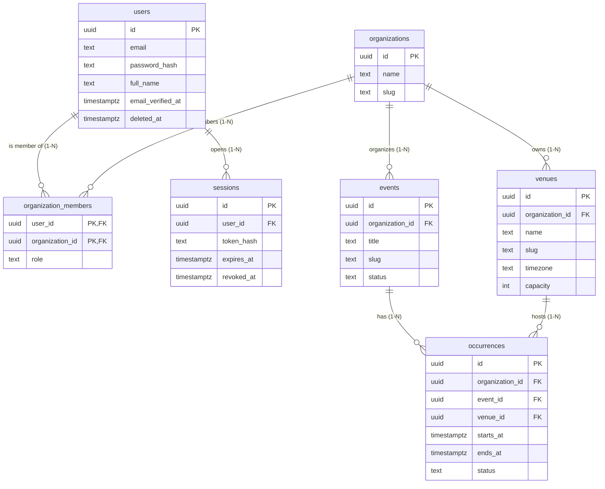

# ER diyagramı

```mermaid
erDiagram
  users {
    uuid id PK
    text email
    text password_hash
    text full_name
    timestamptz email_verified_at
    timestamptz deleted_at
  }

  organizations {
    uuid id PK
    text name
    text slug
  }

  organization_members {
    uuid user_id PK, FK
    uuid organization_id PK, FK
    text role
  }

  sessions {
    uuid id PK
    uuid user_id FK
    text token_hash
    timestamptz expires_at
    timestamptz revoked_at
  }

  venues {
    uuid id PK
    uuid organization_id FK
    text name
    text slug
    text timezone
    int capacity
  }

  events {
    uuid id PK
    uuid organization_id FK
    text title
    text slug
    text status
  }

  occurrences {
    uuid id PK
    uuid organization_id FK
    uuid event_id FK
    uuid venue_id FK
    timestamptz starts_at
    timestamptz ends_at
    text status
  }

  %% users N-N organizations, bridged by organization_members
  users ||--o{ organization_members : "is member of (1-N)"
  organizations ||--o{ organization_members : "has members (1-N)"
  users ||--o{ sessions : "opens (1-N)"

  organizations ||--o{ venues : "owns (1-N)"
  organizations ||--o{ events : "organizes (1-N)"
  events ||--o{ occurrences : "has (1-N)"
  venues ||--o{ occurrences : "hosts (1-N)"
```
